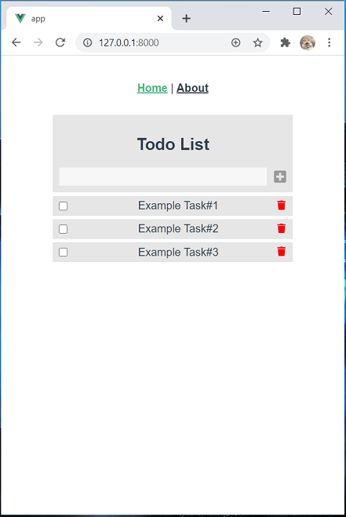

# Todolist (Laravel + Vue.Js) 

A to do list app using Laravel as an API backend and Vue.Js as frontend framework. This project show my skill about CRUD (Create, Read, Update, Delete) and how I build Restful API.



## Requirements

This project requires PHP 7.3+, a MySQL database, [Composer](https://getcomposer.org/), and [NPM](https://www.npmjs.com/).

You can use [XAMPP](https://www.apachefriends.org/index.html) for PHP and MySql database if you want.

## Installation

Installing composer dependencies :

```sh
composer install
```

Copy and rename .env.example to .env, update the environmental variables such as database, etc :

```sh
cp .env.example .env
```

Generate Laravel key :

```sh
php artisan key:generate
```

Run Laravel migration and seed :

```sh
php artisan migrate:refresh --seed
```

Serve laravel:

```sh
php artisan serve
```
The app will be available on [http://127.0.0.1:8000](http://127.0.0.1:8000/) or if you want make changes in frontend.

Change directory to resources/frontend/app :

```sh
cd resources/frontend/app
```

install npm packages :

```sh
npm install
```

Serve app :

```sh
npm run serve
```

Or doing it by Vue UI with:

```sh
vue ui
```

## Usage example

Add Item, mark as complete, delete item.

## Contributing

1. Fork it (<https://github.com/yourname/yourproject/fork>)
2. Create your feature branch (`git checkout -b feature/fooBar`)
3. Commit your changes (`git commit -am 'Add some fooBar'`)
4. Push to the branch (`git push origin feature/fooBar`)
5. Create a new Pull Request
